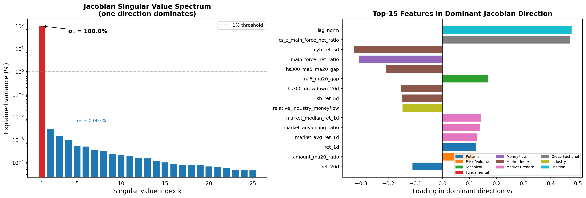
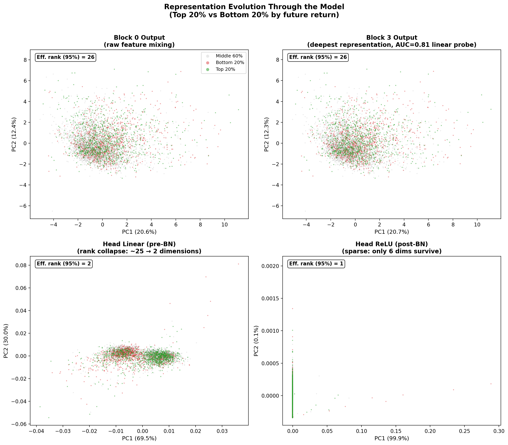
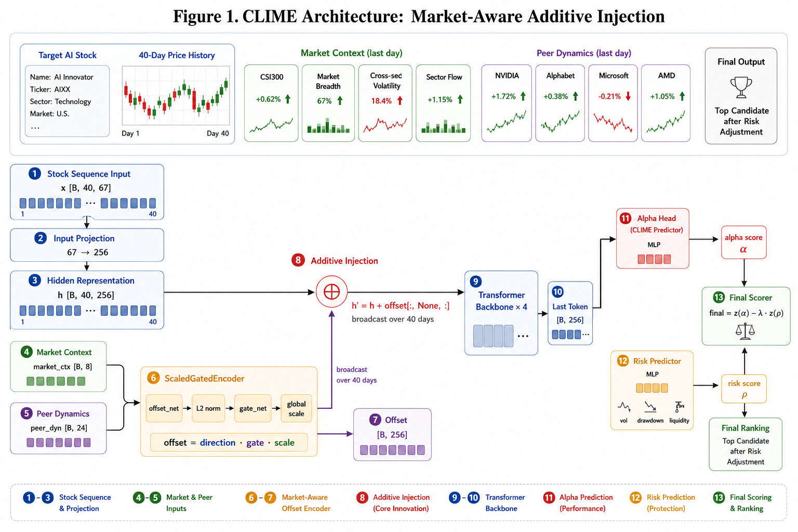
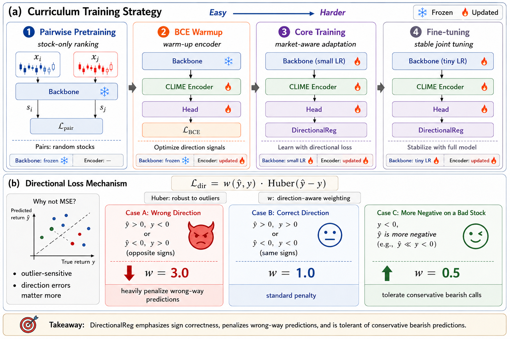

# CLIME — Cross-Modal Injection via Learned Market Encoding

**跨模态市场信息注入的股票排序模型**：面向 A 股日频选股的 Transformer 横截面排序模型。

CLIME 将次日收益预测建模为横截面 top-K 排序任务（每日约 4000–5000 只股票中判断哪些值得进入 top-20 组合），通过 **ScaledGatedEncoder** 将同业动态（peer dynamics）与市场上下文（market context）以受控加法方式注入 Backbone 表征空间，实现市场环境自适应的股票排序。项目为「深度学习基础」课程大作业，完整方法论与实验分析见 [final_report/main.pdf](final_report/main.pdf)。

## 目录

- [简介](#简介)
- [快速开始](#快速开始)
- [核心结果](#核心结果)
- [方法概览](#方法概览)
- [代码结构](#代码结构)
- [报告](#报告)
- [安装与运行](#安装与运行)
- [交易模拟](#交易模拟)
- [消融实验](#消融实验)
- [版本演进概要](#版本演进概要)
- [复现说明](#复现说明)
- [FAQ](#faq)
- [许可与致谢](#许可与致谢)

---

## 简介

A 股日频选股本质上是一个**横截面排序问题**：模型不需要精确预测单只股票次日收益，而是需要在每天上千只股票中给出可靠的相对排序，从而稳定选出 top-20 组合。这一视角带来两个直接后果：一是训练目标应贴近排序/方向决策而非逐点回归；二是单只股票的时序序列缺乏「同业相对强弱」与「市场整体环境」这两类横截面上下文。

CLIME（Cross-Modal Injection via Learned Market Encoding）针对以上两点做出三项设计：

1. **两阶段课程训练**：Stage-1 用 pairwise ranking 损失预训练纯 Backbone，习得可靠的横截面排序表示；Stage-2 以 BCE 方向预热 → Directional Regression Loss 精调，从易到难引导收敛。
2. **ScaledGatedEncoder（受控加法注入）**：将 peer dynamics（24 维）与 market context（8 维）经方向网络 + 门控 + 全局 scale 三者约束后，以加法方式注入 Backbone 表征，显式保护预训练表示不被覆盖（对比 FiLM 乘性调制）。
3. **非对称 Directional Regression Loss**：对方向错误施加 3 倍惩罚、对保守悲观预测降低权重，使逐点回归目标与排序/方向目标对齐。

在 holdout 测试集（2025-12-05 至 2026-05-11，100 个交易日）上，CLIME 取得 **+137.15% 累计收益 / +123.14% 超额收益（Sharpe 6.94）**，显著优于最强线性基线 Ridge（+91.65% 超额）。消融实验表明训练策略组件（Stage-1 预训练、课程预热）的贡献大于架构组件，且全部分解结果均支撑上述设计取舍。同花顺模拟交易 −19.40% 被解释为执行层异常的案例，说明 alpha predictor、组合构建与执行必须作为独立模块分别建模。

> **重要免责声明**：本文及代码报告的全部收益数字均为 **Top-20 等权日调仓、零交易成本、t+1 收盘价成交** 下的选股信号上限估计，**非可实现的策略净收益**。真实交易还需叠加手续费、滑点、涨跌停、T+1 约束与流动性成本。详见报告附录 B（Evaluation Details）。

## 快速开始

```bash
# 1. 安装依赖
pip install -r requirements.txt

# 2. 准备数据并构建缓存（data/ 需自行放置课程提供的 A 股日频数据，见下方「数据准备」）
python build_caches.py --split all
python build_peer_dynamics.py

# 3. 训练 + 回测
python train.py --stage1                                    # Stage 1 Backbone 预训练（~2h, A100）
python train.py --clime --init-scale 0.3                    # Stage 2 CLIME 完整训练（~1.5h, A100）
python backtest.py --clime --stage1 output/transformer_v5/stage1_best.pt
```

## 核心结果

以下为 holdout 测试集（2025-12-05 至 2026-05-11，100 个交易日）上 **Top-20 等权日调仓、零交易成本** 的信号评估结果（报告 Section 3, RQ1）。市场等权组合同期累计收益为 **+14.01%**。

| 模型 | 累计收益 | 超额收益 | Sharpe | 最大回撤 | 日胜率 | 月胜率 |
|---|---|---|---|---|---|---|
| **CLIME** | **+137.15%** | **+123.14%** | **6.94** | 8.03% | 65.0% | 6 / 6 |
| Ridge（最强线性基线） | +105.66% | +91.65% | 5.91 | 6.50% | 68.0% | 5 / 6 |
| LightGBM | +105.34% | +91.33% | 3.67 | 14.34% | 61.0% | 6 / 6 |
| XGBoost | +93.21% | +79.20% | 3.45 | 12.70% | 57.0% | 6 / 6 |
| GRU | +13.92% | −0.09% | 0.02 | 12.48% | 43.0% | 3 / 6 |
| MLP | −17.17% | −31.18% | −2.05 | 28.95% | 34.0% | 1 / 6 |

CLIME 在 6 个持有月全部取得正超额；9 段历史极端行情回测（2018 贸易战、2020 COVID、2022 封城、2024 微盘股崩盘等）全部录得正超额，其中 2024 Q3–Q4 政策牛市期间全市场等权 −5.60%，CLIME 累计 +107.38%、超额 +112.98%。

### 内部分析（RQ3）

模型并非黑箱：Jacobian 有效秩为 1（第一奇异值占 95% 以上方差），线性探针 AUC 0.806（Spearman ρ 0.415），线性分解 R² 0.206（非线性方差占比 79.4%）。top-20 日均超额分解中，全模型 +2.15%、仅线性分量 +2.12%、仅非线性残差 +0.15%，说明排序信息主要由线性分量承载。





## 方法概览

CLIME 采用双流设计：Backbone 处理个股特征序列，ScaledGatedEncoder 处理同业动态与市场上下文，二者在 256 维表征空间通过加法融合。





```
 x [B, L=40, F=67]           peer_dyn [B, 24]
       |                            |
       v                            v
+------------------+    +---------------------------+
|  Backbone        |    |  ScaledGatedEncoder       |
|  (Stage1 预训练)  |    |  (报告 Section 2.3.2)     |
|                  |    |                           |
|  input_proj      |    |  peer_dyn [24]            |
|    → 256 dim     |    |  + market_ctx [8]         |
|  RoPE            |    |    → offset_net (3×MLP)   |
|  4× Transformer  |    |    → gate_net (Sigmoid)   |
|  (Pre-LN, 8头)   |    |    → logit_scale (tanh)   |
|  last-token      |    +-------------+-------------+
|    → [B, 256]    |                  |
+--------+---------+                  v
         |        offset = gate · tanh(s) · û/||û|| · √256
         |                  |
         +--------+---------+
                  v
       h' = h + offset   (广播至全部 40 个时间步)
                  |
                  v
       RoPE → 4×TransformerBlock → last-token
                  |
                  v
            head → score [B]
```

### 核心设计原则

1. **加法注入（$h' = h + \text{offset}$）**：保留 Backbone 原始判断，市场信息仅作增量修正。与 FiLM 乘性调制（$\gamma \odot h + \beta$）的对比见报告 Section 2.3.3 及附录 E。
2. **三重约束**：
   - **方向归一化**（$\hat{\mathbf{u}} / \|\hat{\mathbf{u}}\|$）：offset_net 只控制方向，不控制幅度；
   - **逐股票门控**（$g \in [0, 1]$）：不同股票可接收不同程度的市场修正；
   - **全局幅度约束**（$\tanh(s) \cdot \sqrt{256}$）：可学习但受 tanh 限制。
3. **正确的调制层级**：注入发生在 256 维表征空间（Backbone output projection 之后），而非 67 维输入特征空间或最终标量分数之上。
4. **两阶段课程训练**：Stage-1 pairwise ranking 预训练 → Stage-2 BCE 方向预热 → DirectionalReg 核心训练 → 低学习率精调。训练策略的消融影响大于架构组件（报告 Section 3, RQ2）。

**模型规模**：总参数量约 2.8M（Backbone 约 2.3M + ScaledGatedEncoder 约 0.5M）；L=40 日、F=67 维、peer dynamics 24 维、market context 8 维；hidden 256、8 heads、4 层、FFN 1024、RoPE。

## 代码结构

```
reconstruct_code/
├── train.py                     # 训练入口 (Stage 1 + Stage 2)
├── backtest.py                  # 回测评估 (Top-20 等权日调仓)
├── daily_inference.py           # 每日推理与选股输出
├── build_caches.py              # 特征序列缓存构建
├── build_peer_dynamics.py       # Peer dynamics 缓存构建
├── requirements.txt             # Python 依赖
├── README.md                    # 本文档
├── final_report/                # 完整报告（LaTeX 源码 + PDF + 图）
├── data/                        # [用户准备] 原始数据 (见下方说明)
├── cache/                       # [自动生成] 标准化特征 + 序列 + peer dynamics
├── output/                      # [自动生成] 模型 checkpoint + 日志 + 回测结果
└── src/
    ├── losses.py                # Pairwise ranking loss + Directional regression loss
    ├── trainer.py               # Stage 1 训练循环 (early stopping + checkpoint)
    ├── risk.py                  # 风险估计器 (报告 Section 2.5, 附录 G)
    ├── models/
    │   ├── transformer.py       # Backbone: Transformer + RoPE + AttentionPooling
    │   └── v9ca_ab.py           # CLIME 完整模型: ScaledGatedEncoder + head
    └── data/
        ├── loader.py            # 原始 CSV 并行加载与合并
        ├── features.py          # 86 维特征计算 (报告附录 A)
        ├── preprocess.py        # 缺失值填充 + Winsorize + 截面 z-score
        └── dataset.py           # PairDataset / RegressionPeerDataset / 序列构建
```

**报告章节与代码对应关系：**

| 报告章节 | 对应代码 |
|---|---|
| Section 2.1 (Problem Formulation) | `src/data/dataset.py` — L=40, F=67, 滑动窗口构建 |
| Section 2.2 (Feature Design) | `src/data/features.py` — 86 维特征计算; `build_peer_dynamics.py` — 24 维 peer dynamics |
| Section 2.3 (Model Architecture) | `src/models/transformer.py` (Backbone) + `src/models/v9ca_ab.py` (CLIME 完整模型) |
| Section 2.4 (Training Pipeline) | `train.py` (Stage1+Stage2) + `src/losses.py` + `src/trainer.py` |
| Section 2.5 (Risk-Adjusted Scoring) | `src/risk.py` — 规则驱动风险估计器 |
| Section 3 (Experiments) | `backtest.py` — Top-20 等权日调仓回测 |
| Section 4 (Trading Simulation) | `daily_inference.py` — 每日推理与选股输出 |
| 附录 A (Feature Definitions) | `src/data/features.py` — 完整特征名列表 `FEATURE_NAMES` |
| 附录 D (Complete Hyperparameters) | `train.py` — `CFG_STAGE1` / `CFG_CLIME` 字典 |
| 附录 G (Risk Config) | `src/risk.py` — 风险维度与权重配置 |

## 报告

完整报告见 **[final_report/main.pdf](final_report/main.pdf)**（LaTeX 源码在 `final_report/`，可直接编译；GitHub 支持在线预览 PDF）。

```
final_report/
├── main.tex                      # 报告入口，\input 全部 sections
├── main.pdf                      # 编译产物（约 32 页）
├── sections/                     # abstract / introduction / methodology /
│                                 #   experiment / trading / discussion / appendix
├── figures/                      # 架构图、训练流程、消融与内部分析图
├── literature_survey.md          # 文献调研笔记（LTR / RLHF / 加性注入相关）
├── trading_simulation_summary.md # 模拟交易总结（-19.40% 执行层归因）
├── trading_records_from_pic.md   # 模拟交易逐日记录复盘
└── pic/                          # 模拟交易行情截图
```

报告附录覆盖：A 特征定义、B 评估细节（防前瞻偏差 + 与真实交易差异）、C 复现指南、D 完整超参数、E 版本演进、F checkpoint 索引、G 风险预测器配置。

## 安装与运行

### 环境要求

- Python 3.10+
- CUDA 12.1+（推荐；CPU 也可运行但回测较慢）
- NVIDIA A100 80GB（训练用；Stage 1 约 2 小时，Stage 2 约 1.5 小时）

```bash
pip install -r requirements.txt
```

依赖（见 `requirements.txt`）：`torch>=2.0.0`, `numpy>=1.24.0`, `pandas>=2.0.0`, `scipy>=1.10.0`, `tqdm>=4.64.0`, `pyarrow>=10.0.0`。无其他第三方依赖。

### 数据准备

原始 A 股日频数据（课程提供）按以下结构放入 `data/` 目录（本仓库不含原始数据）：

```
data/
├── basic.csv                    # 股票基础信息 (ts_code, industry, area, market, act_name, act_ent_type, list_date)
├── trade_cal.csv                # 交易日历 (cal_date, is_open, pretrade_date)
├── daily/                       # 个股日频行情 (文件命名: YYYYMMDD.csv)
├── daily_open/                  # 开盘价数据
├── metric/                      # 基本面指标 (PE, PB, 换手率, 总市值等)
├── moneyflow/                   # 资金流向 (大单/中单/小单/特大单买卖)
├── market/                      # 市场指数 (000001.SH, 000300.SH, 399006.SZ)
├── index_weight/                # 指数成分股及权重
├── stock_st/                    # ST 股票清单 (文件命名: YYYYMMDD.csv)
└── news/                        # 新闻快讯 (本项目未使用)
```

**数据划分**（与报告 Section 3 Table 1 一致）：

| Split | 日期范围 | 交易日 | Step | 用途 |
|---|---|---|---|---|
| train_v5 | 2016-01-04 至 2025-09-17 | ~1700 | 10 | Stage 1 + Stage 2 训练 |
| val_v5 | 2025-09-18 至 2025-12-04 | 50 | 1 | 早停与超参数选择 |
| holdout_v5 | 2025-12-05 至 2026-05-11 | 100 | 1 | 最终评估（仅使用一次） |

### 1. 特征工程与缓存构建

```bash
python build_caches.py --split all     # 构建 train/val/holdout 三段序列缓存 (L=40 滑动窗口)
python build_peer_dynamics.py          # 构建 24 维 peer dynamics 缓存
```

自动生成于 `cache/`：标准化特征表 `normalized_features.parquet`、序列缓存 `{split}_L40_step{step}.pt`、peer dynamics 缓存 `v7_peer_dynamics_{split}_L40_step{step}.pt`。

### 2. 训练

**Stage 1 — Backbone 预训练**（报告 Section 2.4.1）：

```bash
python train.py --stage1
```

损失函数为 Pairwise Ranking Loss，优化目标为验证集 Top-20 Excess Return，输出 `output/transformer_v5/stage1_best.pt`。

**Stage 2 — CLIME 完整训练**（报告 Section 2.4.2）：

```bash
python train.py --clime --init-scale 0.3 --epochs 25
```

三阶段课程训练：

| Phase | Epochs | Loss | Backbone LR | Encoder LR | Head LR | 说明 |
|---|---|---|---|---|---|---|
| 1 (BCE Warmup) | 1–3 | BCEWithLogits | frozen | 1×10⁻³ | 1×10⁻³ | 仅训练 encoder + head |
| 2 (Core) | 4–15 | DirectionalReg | 1×10⁻⁵ | 5×10⁻⁴ | 5×10⁻⁴ | 解冻 backbone 联合训练 |
| 3 (Fine-tune) | 16–25 | DirectionalReg | 1×10⁻⁶ | 5×10⁻⁵ | 1×10⁻⁵ | 全部 LR 降低精调 |

`--init-scale` 控制市场信息注入的初始幅度（报告附录 D）。grid search 最优值为 **0.3**；过大（0.5）会让市场信号覆盖 Backbone 判断，过小（0.1）则注入不足。

### 3. 回测评估（报告 Section 3.2）

```bash
# 在 val + holdout 上运行
python backtest.py --clime --stage1 output/transformer_v5/stage1_best.pt

# 仅 holdout，自定义 top-K
python backtest.py --clime --split holdout_v5 \
    --clime-ckpt output/transformer_v5/clime_is0p3_best.pt \
    --stage1 output/transformer_v5/stage1_best.pt \
    --n 20
```

评估协议：Top-K 等权日调仓、零交易成本、t+1 日收盘价成交。该协议隔离模型排序信号，不与真实策略净收益直接可比。

### 4. 每日推理（报告 Section 4）

```bash
python daily_inference.py --date 20260530 \
    --model-path output/transformer_v5/clime_is0p3_best.pt \
    --capital 1000000 --lambda-risk 0.3 --top-n 20
```

选股流程：

1. CLIME 模型输出所有可交易股票的 alpha 分数；
2. 风险估计器输出风险分数（报告 Section 2.5，附录 G）；
3. Alpha top-10% 候选池内：`final = z(alpha) − λ · z(risk)`；
4. 取 final top-20，温度 softmax 分配权重。

离线实验中 λ = 0；模拟交易中建议 λ = 0.3。

## 交易模拟

作为端到端压力测试，项目在 2026 年 6 月初（06-01 至 06-11，约 9 个交易日）用 CLIME alpha 分数叠加风险过滤（λ=0.3）进行了一次同花顺模拟交易。最终收益为 **−19.40%**（选股成功率 21.90%），显著弱于离线回测结果。

逐日调仓复盘（[trading_simulation_summary.md](final_report/trading_simulation_summary.md)、[trading_records_from_pic.md](final_report/trading_records_from_pic.md)）显示，该结果主要来自日频信号与盘中人工执行的协议差异：

- 无固定调仓时点，人工盘中手动下单，日内波动造成执行偏差；
- 先卖后买的资金释放约束；
- 弱势市场下的人工择时压力；
- 后期仓位集中。

因此该结果被解释为**执行层异常案例**，而不是对 CLIME 离线排序能力的否定——它说明 alpha predictor、risk/scoring、portfolio selection 与 execution 必须作为不同模块分别建模（报告 Section 4）。

## 消融实验

CLIME 的最终性能由四类组件共同决定（报告 Section 3, RQ2）：

| 消融变体 | 操作 | 超额收益变化 | 关键结论 |
|---|---|---|---|
| T1_MSE | DirectionalReg → Huber | −57 pp | 方向感知权重对 top-K 收益至关重要 |
| T2_NoCur | 跳过 BCE 方向预热 | −128 pp | 直接解冻 backbone 会破坏预训练表示 |
| T3_NoS1 | 跳过 Stage 1 预训练 | −150 pp | 随机初始化 backbone 无法在 Stage 2 收敛 |
| E1_NoEnc | 移除 ScaledGatedEncoder | −74 pp | 市场注入整体重要 |

消融影响排序：**训练策略（T3, T2）> 架构组件（E1）> 损失函数（T1）**。完整讨论见报告 Section 3 (RQ2) 及 Section 5 (Discussion)。

## 版本演进概要

完整版本演进表见报告附录 E。下表仅保留关键转折点（附录 E 采用与 RQ1 略有不同的市场基准计算粒度，故 V9CA_AB is0.3 在附录中记为 +148.44% 累计 / +133.29% 超额，正文 RQ1 口径为 +137.15% 累计 / +123.14% 超额）：

| 版本 | 关键改动 | Holdout 超额 | 结论 |
|---|---|---|---|
| V5 | 纯 Transformer + Stage1 pairwise | +111.01% | 基线确立 |
| V7 | FiLM 乘性调制 | +40.72% | **乘性调制属于结构性陷阱** |
| V9CA | 加法注入 `h' = h + offset` | +80.69% | 架构方向正确 |
| V9CA_AB is0.3 | +gate + tanh scale (init=0.3) | **+133.29%** | **当前最优** |
| V9CA_AB is0.5 | init_scale 过大 | +86.56% | 市场信号过强侵蚀 Backbone |
| V11 | Attn Pooling + 87 维 + Hard Mining | −4.59% | 三项未验证改动堆叠 → 报废（反面教训） |

核心教训：

1. **乘性调制是本任务的结构性陷阱**：FiLM 的各项变体全部退化。
2. **加法注入是正确范式**：`h' = h + offset` 作为修正项，保留 Backbone 主信号。
3. **逐项验证是工程纪律**：V11 一次堆叠三项改动直接导致模型报废，此后每个改动单独验证。
4. **init_scale 存在最优区间**：0.1 → 0.3 梯度提升，0.5 开始退化。

## 复现说明

- **原始数据不入库**：`data/` 需自行从课程获取并按上述结构放置；`cache/` 与 `output/` 均为本地构建产物。
- **收益为信号上限**：所有回测数字不含交易成本/滑点/涨跌停/T+1 约束，不可直接视为可实现净收益（见报告附录 B）。
- **checkpoint 复现消融**：`stage1_best.pt`（Stage 1 预训练）、`clime_is0p3_best.pt`（完整 CLIME）、`ablation_t1_mse_best.pt`、`ablation_t2_no_curriculum_best.pt`、`ablation_t3_no_stage1_best.pt`、`ablation_e1_no_encoder_best.pt` 分别对应报告 RQ2 四个消融变体，可用 `backtest.py --clime --clime-ckpt <path>` 加载复现。
- **结果稳定性**：从随机初始化重新训练得到的模型在 holdout 集上的核心收益指标与 best checkpoint 差异控制在约 5% 以内，结果不是单次随机种子或 checkpoint 选择的偶然产物（报告附录 C）。

## FAQ

**训练/回测时 CUDA OOM？**
减小 `--batch-size`，或使用 `--device cpu`。Stage 1 默认 batch_size=2048，Stage 2 默认 batch_size=256。

**Checkpoint 加载报 missing keys？**
正常现象。Stage 1 checkpoint 中的 `attn_pool` 和 `head` 权重在 CLIME (Stage 2) 中不使用——CLIME 手动拆开 Backbone 使用 last-token 聚合，并创建独立的 prediction head。训练脚本会打印 missing keys 数量供确认。

**特征缓存维度比 67 大？**
缓存存储的是全量 87 维（86 base + lag_norm），包含 V11 的 20 个额外特征。Stage 2 训练和推理时通过 `CLIME_FEATURE_INDICES = list(range(66)) + [86]` 自动切片到 67 维。不需要重建缓存。

**为什么输出目录叫 `transformer_v5`？**
该目录名保留自项目早期版本（V5 为第一个可用版本），当前 CLIME 模型仍使用同一输出路径以保证向后兼容。

## 许可与致谢

本项目为「深度学习基础」课程大作业。作者：费维瀚（PB24000347）、赵瀚焜、寇之洲（组员分工见 [final_report/main.pdf](final_report/main.pdf) 首页脚注）。

数据来自课程提供的 A 股日频行情（聚宽数据），本仓库不包含原始数据。方法设计参考了学习排序（Joachims 2002; Burges 2005）、RLHF 偏好范式（Christiano 2017; Ouyang 2022）、课程学习（Bengio 2009）以及加性注入方法（Adapter / LoRA / ControlNet），详细文献梳理见 [final_report/literature_survey.md](final_report/literature_survey.md)。
